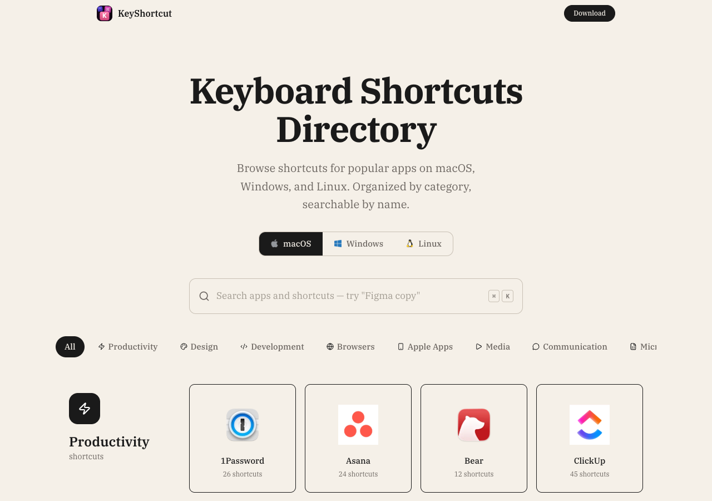

# KeyShortcut.com — Every keyboard shortcut, searchable and organized.

[](https://github.com/vladik-Didyk/KeyShortcut/actions/workflows/ci.yml)
[](https://opensource.org/licenses/MIT)

<p align="center">
  <a href="https://keyshortcut.com">
    
  </a>
</p>

<p align="center">
  <strong>Browse shortcuts for popular apps on macOS, Windows, and Linux.</strong><br/>
  Organized by category. Searchable by name. Free and open source.
</p>

<p align="center">
  <a href="https://keyshortcut.com"><strong>Visit the site</strong></a> &nbsp;&middot;&nbsp;
  <a href="https://github.com/vladik-Didyk/KeyShortcut/issues">Report a bug</a> &nbsp;&middot;&nbsp;
  <a href="https://github.com/vladik-Didyk/KeyShortcut/issues">Request a feature</a>
</p>

---

## Introduction

Hi! I'm Vlad, the creator of [KeyShortcut.com](https://keyshortcut.com).

KeyShortcut is a keyboard shortcuts directory that lists shortcuts for popular apps across **macOS**, **Windows**, and **Linux** — all in one place, organized by category and fully searchable. It helps thousands of users every month find the shortcuts they need to speed up their workflow.

### What you get

- **Search across all apps** — type "Figma copy" or "paste in Chrome" and get instant results
- **Multi-platform** — switch between macOS, Windows, and Linux with one click
- **Many apps covered** — Productivity, Design, Development, Browsers, Communication, and more
- **Organized by category** — find related apps together
- **Clean, fast interface** — pre-rendered static pages, no loading spinners
- **Printable cheat sheets** — export any app's shortcuts as a PDF

## Supported apps

<!-- APP-DIRECTORY:START — auto-generated, do not edit manually -->

<details>
<summary><strong>macOS</strong> — 102 apps</summary>

<h4>macOS System</h4>

<table>
<tr>
<td align="center"><a href="https://keyshortcut.com/macos/macos"><br /><sub>macOS</sub></a></td>
<td></td>
<td></td>
<td></td>
<td></td>
<td></td>
<td></td>
<td></td>
</tr>
</table>

<h4>Apple Apps</h4>

<table>
<tr>
<td align="center"><a href="https://keyshortcut.com/macos/calendar"><br /><sub>Calendar</sub></a></td><td align="center"><a href="https://keyshortcut.com/macos/keynote"><br /><sub>Keynote</sub></a></td><td align="center"><a href="https://keyshortcut.com/macos/mail"><br /><sub>Mail</sub></a></td><td align="center"><a href="https://keyshortcut.com/macos/numbers"><br /><sub>Numbers</sub></a></td><td align="center"><a href="https://keyshortcut.com/macos/pages"><br /><sub>Pages</sub></a></td><td align="center"><a href="https://keyshortcut.com/macos/photos"><br /><sub>Photos</sub></a></td><td align="center"><a href="https://keyshortcut.com/macos/preview"><br /><sub>Preview</sub></a></td><td align="center"><a href="https://keyshortcut.com/macos/reminders"><br /><sub>Reminders</sub></a></td>
</tr>
</table>

<h4>Browsers</h4>

<table>
<tr>
<td align="center"><a href="https://keyshortcut.com/macos/arc"><br /><sub>Arc</sub></a></td><td align="center"><a href="https://keyshortcut.com/macos/brave"><br /><sub>Brave</sub></a></td><td align="center"><a href="https://keyshortcut.com/macos/chrome"><br /><sub>Chrome</sub></a></td><td align="center"><a href="https://keyshortcut.com/macos/chrome-devtools"><br /><sub>Chrome DevTools</sub></a></td><td align="center"><a href="https://keyshortcut.com/macos/edge"><br /><sub>Edge</sub></a></td><td align="center"><a href="https://keyshortcut.com/macos/firefox"><br /><sub>Firefox</sub></a></td><td align="center"><a href="https://keyshortcut.com/macos/opera"><br /><sub>Opera</sub></a></td><td align="center"><a href="https://keyshortcut.com/macos/safari"><br /><sub>Safari</sub></a></td>
</tr>
<tr>
<td align="center"><a href="https://keyshortcut.com/macos/tor-browser"><br /><sub>Tor Browser</sub></a></td><td align="center"><a href="https://keyshortcut.com/macos/vivaldi"><br /><sub>Vivaldi</sub></a></td>
<td></td>
<td></td>
<td></td>
<td></td>
<td></td>
<td></td>
</tr>
</table>

<h4>Development</h4>

<table>
<tr>
<td align="center"><a href="https://keyshortcut.com/macos/android-studio"><br /><sub>Android Studio</sub></a></td><td align="center"><a href="https://keyshortcut.com/macos/clion"><br /><sub>CLion</sub></a></td><td align="center"><a href="https://keyshortcut.com/macos/cursor"><br /><sub>Cursor</sub></a></td><td align="center"><a href="https://keyshortcut.com/macos/datagrip"><br /><sub>DataGrip</sub></a></td><td align="center"><a href="https://keyshortcut.com/macos/dataspell"><br /><sub>DataSpell</sub></a></td><td align="center"><a href="https://keyshortcut.com/macos/dbeaver"><br /><sub>DBeaver</sub></a></td><td align="center"><a href="https://keyshortcut.com/macos/eclipse"><br /><sub>Eclipse</sub></a></td><td align="center"><a href="https://keyshortcut.com/macos/emacs"><br /><sub>GNU Emacs</sub></a></td>
</tr>
<tr>
<td align="center"><a href="https://keyshortcut.com/macos/godot"><br /><sub>Godot Engine</sub></a></td><td align="center"><a href="https://keyshortcut.com/macos/goland"><br /><sub>GoLand</sub></a></td><td align="center"><a href="https://keyshortcut.com/macos/insomnia"><br /><sub>Insomnia</sub></a></td><td align="center"><a href="https://keyshortcut.com/macos/intellij"><br /><sub>IntelliJ IDEA</sub></a></td><td align="center"><a href="https://keyshortcut.com/macos/iterm"><br /><sub>iTerm2</sub></a></td><td align="center"><a href="https://keyshortcut.com/macos/jupyter"><br /><sub>Jupyter Notebook</sub></a></td><td align="center"><a href="https://keyshortcut.com/macos/matlab"><br /><sub>MATLAB</sub></a></td><td align="center"><a href="https://keyshortcut.com/macos/sql-developer"><br /><sub>Oracle SQL Developer</sub></a></td>
</tr>
<tr>
<td align="center"><a href="https://keyshortcut.com/macos/phpstorm"><br /><sub>PHPStorm</sub></a></td><td align="center"><a href="https://keyshortcut.com/macos/postman"><br /><sub>Postman</sub></a></td><td align="center"><a href="https://keyshortcut.com/macos/pycharm"><br /><sub>PyCharm</sub></a></td><td align="center"><a href="https://keyshortcut.com/macos/rider"><br /><sub>Rider</sub></a></td><td align="center"><a href="https://keyshortcut.com/macos/rstudio"><br /><sub>RStudio</sub></a></td><td align="center"><a href="https://keyshortcut.com/macos/rubymine"><br /><sub>RubyMine</sub></a></td><td align="center"><a href="https://keyshortcut.com/macos/sublime-text"><br /><sub>Sublime Text</sub></a></td><td align="center"><a href="https://keyshortcut.com/macos/terminal"><br /><sub>Terminal</sub></a></td>
</tr>
<tr>
<td align="center"><a href="https://keyshortcut.com/macos/tower"><br /><sub>Tower</sub></a></td><td align="center"><a href="https://keyshortcut.com/macos/unity"><br /><sub>Unity</sub></a></td><td align="center"><a href="https://keyshortcut.com/macos/unreal-engine"><br /><sub>Unreal Engine</sub></a></td><td align="center"><a href="https://keyshortcut.com/macos/vim"><br /><sub>Vim</sub></a></td><td align="center"><a href="https://keyshortcut.com/macos/visual-studio"><br /><sub>Visual Studio</sub></a></td><td align="center"><a href="https://keyshortcut.com/macos/vscode"><br /><sub>VS Code</sub></a></td><td align="center"><a href="https://keyshortcut.com/macos/warp"><br /><sub>Warp</sub></a></td><td align="center"><a href="https://keyshortcut.com/macos/webstorm"><br /><sub>WebStorm</sub></a></td>
</tr>
<tr>
<td align="center"><a href="https://keyshortcut.com/macos/xcode"><br /><sub>Xcode</sub></a></td>
<td></td>
<td></td>
<td></td>
<td></td>
<td></td>
<td></td>
<td></td>
</tr>
</table>

<h4>Communication</h4>

<table>
<tr>
<td align="center"><a href="https://keyshortcut.com/macos/discord"><br /><sub>Discord</sub></a></td><td align="center"><a href="https://keyshortcut.com/macos/gmail"><br /><sub>Gmail</sub></a></td><td align="center"><a href="https://keyshortcut.com/macos/messages"><br /><sub>Messages</sub></a></td><td align="center"><a href="https://keyshortcut.com/macos/slack"><br /><sub>Slack</sub></a></td><td align="center"><a href="https://keyshortcut.com/macos/teams"><br /><sub>Teams</sub></a></td><td align="center"><a href="https://keyshortcut.com/macos/telegram"><br /><sub>Telegram</sub></a></td><td align="center"><a href="https://keyshortcut.com/macos/zoom"><br /><sub>Zoom</sub></a></td>
<td></td>
</tr>
</table>

<h4>Productivity</h4>

<table>
<tr>
<td align="center"><a href="https://keyshortcut.com/macos/1password"><br /><sub>1Password</sub></a></td><td align="center"><a href="https://keyshortcut.com/macos/asana"><br /><sub>Asana</sub></a></td><td align="center"><a href="https://keyshortcut.com/macos/bear"><br /><sub>Bear</sub></a></td><td align="center"><a href="https://keyshortcut.com/macos/clickup"><br /><sub>ClickUp</sub></a></td><td align="center"><a href="https://keyshortcut.com/macos/confluence"><br /><sub>Confluence</sub></a></td><td align="center"><a href="https://keyshortcut.com/macos/github"><br /><sub>GitHub</sub></a></td><td align="center"><a href="https://keyshortcut.com/macos/gitlab"><br /><sub>GitLab</sub></a></td><td align="center"><a href="https://keyshortcut.com/macos/google-docs"><br /><sub>Google Docs</sub></a></td>
</tr>
<tr>
<td align="center"><a href="https://keyshortcut.com/macos/google-drive"><br /><sub>Google Drive</sub></a></td><td align="center"><a href="https://keyshortcut.com/macos/google-sheets"><br /><sub>Google Sheets</sub></a></td><td align="center"><a href="https://keyshortcut.com/macos/jira"><br /><sub>Jira</sub></a></td><td align="center"><a href="https://keyshortcut.com/macos/jira-align"><br /><sub>Jira Align</sub></a></td><td align="center"><a href="https://keyshortcut.com/macos/notes"><br /><sub>Notes</sub></a></td><td align="center"><a href="https://keyshortcut.com/macos/notion"><br /><sub>Notion</sub></a></td><td align="center"><a href="https://keyshortcut.com/macos/obsidian"><br /><sub>Obsidian</sub></a></td><td align="center"><a href="https://keyshortcut.com/macos/raycast"><br /><sub>Raycast</sub></a></td>
</tr>
<tr>
<td align="center"><a href="https://keyshortcut.com/macos/stata"><br /><sub>Stata</sub></a></td><td align="center"><a href="https://keyshortcut.com/macos/things"><br /><sub>Things</sub></a></td><td align="center"><a href="https://keyshortcut.com/macos/todoist"><br /><sub>Todoist</sub></a></td><td align="center"><a href="https://keyshortcut.com/macos/trello"><br /><sub>Trello</sub></a></td><td align="center"><a href="https://keyshortcut.com/macos/wordpress"><br /><sub>WordPress</sub></a></td>
<td></td>
<td></td>
<td></td>
</tr>
</table>

<h4>Design</h4>

<table>
<tr>
<td align="center"><a href="https://keyshortcut.com/macos/acrobat"><br /><sub>Acrobat</sub></a></td><td align="center"><a href="https://keyshortcut.com/macos/adobe-xd"><br /><sub>Adobe XD</sub></a></td><td align="center"><a href="https://keyshortcut.com/macos/after-effects"><br /><sub>After Effects</sub></a></td><td align="center"><a href="https://keyshortcut.com/macos/blender"><br /><sub>Blender</sub></a></td><td align="center"><a href="https://keyshortcut.com/macos/canva"><br /><sub>Canva</sub></a></td><td align="center"><a href="https://keyshortcut.com/macos/figma"><br /><sub>Figma</sub></a></td><td align="center"><a href="https://keyshortcut.com/macos/gimp"><br /><sub>GIMP</sub></a></td><td align="center"><a href="https://keyshortcut.com/macos/illustrator"><br /><sub>Illustrator</sub></a></td>
</tr>
<tr>
<td align="center"><a href="https://keyshortcut.com/macos/inkscape"><br /><sub>Inkscape</sub></a></td><td align="center"><a href="https://keyshortcut.com/macos/maya"><br /><sub>Maya</sub></a></td><td align="center"><a href="https://keyshortcut.com/macos/photoshop"><br /><sub>Photoshop</sub></a></td><td align="center"><a href="https://keyshortcut.com/macos/sketch"><br /><sub>Sketch</sub></a></td><td align="center"><a href="https://keyshortcut.com/macos/webflow"><br /><sub>Webflow</sub></a></td>
<td></td>
<td></td>
<td></td>
</tr>
</table>

<h4>Microsoft Office</h4>

<table>
<tr>
<td align="center"><a href="https://keyshortcut.com/macos/excel"><br /><sub>Excel</sub></a></td><td align="center"><a href="https://keyshortcut.com/macos/powerpoint"><br /><sub>PowerPoint</sub></a></td><td align="center"><a href="https://keyshortcut.com/macos/word"><br /><sub>Word</sub></a></td>
<td></td>
<td></td>
<td></td>
<td></td>
<td></td>
</tr>
</table>

<h4>Media</h4>

<table>
<tr>
<td align="center"><a href="https://keyshortcut.com/macos/davinci-resolve"><br /><sub>DaVinci Resolve</sub></a></td><td align="center"><a href="https://keyshortcut.com/macos/final-cut-pro"><br /><sub>Final Cut Pro</sub></a></td><td align="center"><a href="https://keyshortcut.com/macos/music"><br /><sub>Music</sub></a></td><td align="center"><a href="https://keyshortcut.com/macos/premiere-pro"><br /><sub>Premiere Pro</sub></a></td><td align="center"><a href="https://keyshortcut.com/macos/spotify"><br /><sub>Spotify</sub></a></td><td align="center"><a href="https://keyshortcut.com/macos/vlc"><br /><sub>VLC</sub></a></td>
<td></td>
<td></td>
</tr>
</table>

</details>

<details>
<summary><strong>Windows</strong> — 48 apps</summary>

<h4>Browsers</h4>

<table>
<tr>
<td align="center"><a href="https://keyshortcut.com/windows/chrome"><br /><sub>Chrome</sub></a></td><td align="center"><a href="https://keyshortcut.com/windows/firefox"><br /><sub>Firefox</sub></a></td><td align="center"><a href="https://keyshortcut.com/windows/opera"><br /><sub>Opera</sub></a></td><td align="center"><a href="https://keyshortcut.com/windows/tor-browser"><br /><sub>Tor Browser</sub></a></td>
<td></td>
<td></td>
<td></td>
<td></td>
</tr>
</table>

<h4>Development</h4>

<table>
<tr>
<td align="center"><a href="https://keyshortcut.com/windows/datagrip"><br /><sub>DataGrip</sub></a></td><td align="center"><a href="https://keyshortcut.com/windows/dataspell"><br /><sub>DataSpell</sub></a></td><td align="center"><a href="https://keyshortcut.com/windows/dbeaver"><br /><sub>DBeaver</sub></a></td><td align="center"><a href="https://keyshortcut.com/windows/godot"><br /><sub>Godot Engine</sub></a></td><td align="center"><a href="https://keyshortcut.com/windows/insomnia"><br /><sub>Insomnia</sub></a></td><td align="center"><a href="https://keyshortcut.com/windows/jupyter"><br /><sub>Jupyter Notebook</sub></a></td><td align="center"><a href="https://keyshortcut.com/windows/labview"><br /><sub>LabVIEW</sub></a></td><td align="center"><a href="https://keyshortcut.com/windows/matlab"><br /><sub>MATLAB</sub></a></td>
</tr>
<tr>
<td align="center"><a href="https://keyshortcut.com/windows/sql-developer"><br /><sub>Oracle SQL Developer</sub></a></td><td align="center"><a href="https://keyshortcut.com/windows/postman"><br /><sub>Postman</sub></a></td><td align="center"><a href="https://keyshortcut.com/windows/rider"><br /><sub>Rider</sub></a></td><td align="center"><a href="https://keyshortcut.com/windows/rstudio"><br /><sub>RStudio</sub></a></td><td align="center"><a href="https://keyshortcut.com/windows/tortoisegit"><br /><sub>TortoiseGit</sub></a></td><td align="center"><a href="https://keyshortcut.com/windows/unity"><br /><sub>Unity</sub></a></td><td align="center"><a href="https://keyshortcut.com/windows/unreal-engine"><br /><sub>Unreal Engine</sub></a></td><td align="center"><a href="https://keyshortcut.com/windows/visual-studio"><br /><sub>Visual Studio</sub></a></td>
</tr>
<tr>
<td align="center"><a href="https://keyshortcut.com/windows/vscode"><br /><sub>VS Code</sub></a></td><td align="center"><a href="https://keyshortcut.com/windows/webstorm"><br /><sub>WebStorm</sub></a></td>
<td></td>
<td></td>
<td></td>
<td></td>
<td></td>
<td></td>
</tr>
</table>

<h4>Communication</h4>

<table>
<tr>
<td align="center"><a href="https://keyshortcut.com/windows/discord"><br /><sub>Discord</sub></a></td><td align="center"><a href="https://keyshortcut.com/windows/slack"><br /><sub>Slack</sub></a></td><td align="center"><a href="https://keyshortcut.com/windows/teams"><br /><sub>Teams</sub></a></td>
<td></td>
<td></td>
<td></td>
<td></td>
<td></td>
</tr>
</table>

<h4>Productivity</h4>

<table>
<tr>
<td align="center"><a href="https://keyshortcut.com/windows/clickup"><br /><sub>ClickUp</sub></a></td><td align="center"><a href="https://keyshortcut.com/windows/confluence"><br /><sub>Confluence</sub></a></td><td align="center"><a href="https://keyshortcut.com/windows/gitlab"><br /><sub>GitLab</sub></a></td><td align="center"><a href="https://keyshortcut.com/windows/spss"><br /><sub>IBM SPSS Statistics</sub></a></td><td align="center"><a href="https://keyshortcut.com/windows/jira-align"><br /><sub>Jira Align</sub></a></td><td align="center"><a href="https://keyshortcut.com/windows/minitab"><br /><sub>Minitab</sub></a></td><td align="center"><a href="https://keyshortcut.com/windows/notion"><br /><sub>Notion</sub></a></td><td align="center"><a href="https://keyshortcut.com/windows/stata"><br /><sub>Stata</sub></a></td>
</tr>
<tr>
<td align="center"><a href="https://keyshortcut.com/windows/wordpress"><br /><sub>WordPress</sub></a></td>
<td></td>
<td></td>
<td></td>
<td></td>
<td></td>
<td></td>
<td></td>
</tr>
</table>

<h4>Design</h4>

<table>
<tr>
<td align="center"><a href="https://keyshortcut.com/windows/acrobat"><br /><sub>Acrobat</sub></a></td><td align="center"><a href="https://keyshortcut.com/windows/adobe-xd"><br /><sub>Adobe XD</sub></a></td><td align="center"><a href="https://keyshortcut.com/windows/canva"><br /><sub>Canva</sub></a></td><td align="center"><a href="https://keyshortcut.com/windows/figma"><br /><sub>Figma</sub></a></td><td align="center"><a href="https://keyshortcut.com/windows/gimp"><br /><sub>GIMP</sub></a></td><td align="center"><a href="https://keyshortcut.com/windows/inkscape"><br /><sub>Inkscape</sub></a></td><td align="center"><a href="https://keyshortcut.com/windows/maya"><br /><sub>Maya</sub></a></td><td align="center"><a href="https://keyshortcut.com/windows/photoshop"><br /><sub>Photoshop</sub></a></td>
</tr>
<tr>
<td align="center"><a href="https://keyshortcut.com/windows/webflow"><br /><sub>Webflow</sub></a></td>
<td></td>
<td></td>
<td></td>
<td></td>
<td></td>
<td></td>
<td></td>
</tr>
</table>

<h4>Microsoft Office</h4>

<table>
<tr>
<td align="center"><a href="https://keyshortcut.com/windows/excel"><br /><sub>Excel</sub></a></td><td align="center"><a href="https://keyshortcut.com/windows/powerpoint"><br /><sub>PowerPoint</sub></a></td><td align="center"><a href="https://keyshortcut.com/windows/word"><br /><sub>Word</sub></a></td>
<td></td>
<td></td>
<td></td>
<td></td>
<td></td>
</tr>
</table>

<h4>Media</h4>

<table>
<tr>
<td align="center"><a href="https://keyshortcut.com/windows/premiere-pro"><br /><sub>Premiere Pro</sub></a></td>
<td></td>
<td></td>
<td></td>
<td></td>
<td></td>
<td></td>
<td></td>
</tr>
</table>

<h4>Windows System</h4>

<table>
<tr>
<td align="center"><a href="https://keyshortcut.com/windows/windows"><br /><sub>Windows</sub></a></td>
<td></td>
<td></td>
<td></td>
<td></td>
<td></td>
<td></td>
<td></td>
</tr>
</table>

</details>

<details>
<summary><strong>Linux</strong> — 10 apps</summary>

<h4>Browsers</h4>

<table>
<tr>
<td align="center"><a href="https://keyshortcut.com/linux/chrome"><br /><sub>Chrome</sub></a></td><td align="center"><a href="https://keyshortcut.com/linux/firefox"><br /><sub>Firefox</sub></a></td>
<td></td>
<td></td>
<td></td>
<td></td>
<td></td>
<td></td>
</tr>
</table>

<h4>Development</h4>

<table>
<tr>
<td align="center"><a href="https://keyshortcut.com/linux/vim"><br /><sub>Vim</sub></a></td><td align="center"><a href="https://keyshortcut.com/linux/vscode"><br /><sub>VS Code</sub></a></td>
<td></td>
<td></td>
<td></td>
<td></td>
<td></td>
<td></td>
</tr>
</table>

<h4>Communication</h4>

<table>
<tr>
<td align="center"><a href="https://keyshortcut.com/linux/discord"><br /><sub>Discord</sub></a></td><td align="center"><a href="https://keyshortcut.com/linux/slack"><br /><sub>Slack</sub></a></td>
<td></td>
<td></td>
<td></td>
<td></td>
<td></td>
<td></td>
</tr>
</table>

<h4>Productivity</h4>

<table>
<tr>
<td align="center"><a href="https://keyshortcut.com/linux/notion"><br /><sub>Notion</sub></a></td>
<td></td>
<td></td>
<td></td>
<td></td>
<td></td>
<td></td>
<td></td>
</tr>
</table>

<h4>Design</h4>

<table>
<tr>
<td align="center"><a href="https://keyshortcut.com/linux/blender"><br /><sub>Blender</sub></a></td><td align="center"><a href="https://keyshortcut.com/linux/figma"><br /><sub>Figma</sub></a></td>
<td></td>
<td></td>
<td></td>
<td></td>
<td></td>
<td></td>
</tr>
</table>

<h4>System Utils</h4>

<table>
<tr>
<td align="center"><a href="https://keyshortcut.com/linux/linux"><br /><sub>Linux Desktop</sub></a></td>
<td></td>
<td></td>
<td></td>
<td></td>
<td></td>
<td></td>
<td></td>
</tr>
</table>

</details>

<!-- APP-DIRECTORY:END -->

## Contributing

This is an open-source project and contributions are very welcome! Whether it's fixing a typo, reporting a missing shortcut, suggesting a new app, or improving the UI — every bit helps.

**Ways to contribute:**

- **Report bugs or request features** — Open a [GitHub Issue](https://github.com/vladik-Didyk/KeyShortcut/issues)
- **Suggest a new app or missing shortcuts** — Open an issue with the app name and a link to its official shortcut docs
- **Fix something yourself** — Fork the repo, make your changes, and send a PR
- **Improve the data** — Shortcut data lives in Supabase, but you can propose corrections via issues

If you can fix it yourself, please send a PR! Before submitting:

```bash
pnpm lint         # Must pass with no errors
pnpm test         # Must pass all tests
pnpm build        # Must build successfully
```

## Running the project locally

```bash
# Clone
git clone https://github.com/vladik-Didyk/KeyShortcut.git
cd KeyShortcut

# Copy env and fill in your Supabase keys
cp .env.example .env

# Install
pnpm install

# Run
pnpm dev
```

Open [http://localhost:5173](http://localhost:5173) in your browser.

> **Note**: You'll need Supabase credentials to run locally. See the [Environment variables](#environment-variables) section below.

## Environment variables

Copy `.env.example` to `.env` and fill in the required values:

| Variable | Required | Description |
|----------|----------|-------------|
| `VITE_SUPABASE_URL` | Yes | Supabase project URL |
| `VITE_SUPABASE_ANON_KEY` | Yes | Supabase anonymous key |
| `SUPABASE_SERVICE_ROLE_KEY` | For sync | Supabase service role key (shortcut-sync writes) |
| `GEMINI_API_KEY` | For sync | Google Gemini API key (AI-powered scraping) |
| `VITE_CF_ANALYTICS_TOKEN` | No | Cloudflare Web Analytics token |
| `VITE_ADSENSE_ID` | No | Google AdSense publisher ID |
| `VITE_APP_STORE_ID` | No | Mac App Store app ID |

## Scripts

```bash
pnpm dev          # Dev server with HMR
pnpm build        # Production build (icons + sitemap + pre-render)
pnpm preview      # Preview production build locally
pnpm lint         # Run ESLint
pnpm test         # Run test suite
pnpm test:watch   # Run tests in watch mode
pnpm deploy       # Build + deploy to Cloudflare Pages
pnpm sync         # Run shortcut sync pipeline
pnpm sync:dry     # Dry run (no writes to Supabase)
```

## Tech stack

- **React 19** + **React Router v7** (framework mode with SSR + static pre-rendering)
- **Vite 7** + **Tailwind CSS 4**
- **Supabase** (PostgreSQL backend + Storage for app icons)
- **Cloudflare Pages** (static hosting)

All ~175 pages are pre-rendered at build time as static HTML. No Node.js server needed in production.

## Project structure

```
src/
  routes/          Route modules (loaders, meta, components)
  components/      Page sections and reusable UI
  hooks/           Custom hooks (useTheme, useInView, usePlatformData)
  utils/           Helpers (search, platform detection, icons)
  data/            Static content and config
  test/            Test suites
public/
  data/            Runtime JSON (manifest + per-platform shortcut files)
  images/          App icons, platform icons, OG image
scripts/
  download-icons.mjs       Fetch icons from Supabase Storage
  generate-sitemap.mjs     Generate sitemap.xml
  shortcut-sync/           AI-powered shortcut extraction pipeline
```

## Data architecture

All app and shortcut data lives in **Supabase** (PostgreSQL). Route loaders query Supabase at build time during pre-rendering:

```
Supabase → Route loaders → Pre-rendered HTML + .data files → Static deploy
```

**Adding a new platform**: Create `public/data/platforms/{platform}.json`, add an entry to `manifest.json`, run `pnpm build`. No code changes needed.

**Shortcut sync pipeline**: An automated system (`scripts/shortcut-sync/`) that scrapes official documentation, extracts shortcuts using Gemini AI, diffs against existing data, and creates PRs for review.

## Links

- [KeyShortcut.com](https://keyshortcut.com) — Live site
- [KeyShortcut Mac HUD](https://keyshortcut.com/mac-hud) — Mac app product page
- [GitHub Issues](https://github.com/vladik-Didyk/KeyShortcut/issues) — Report bugs or request features

## License

[MIT](LICENSE)
